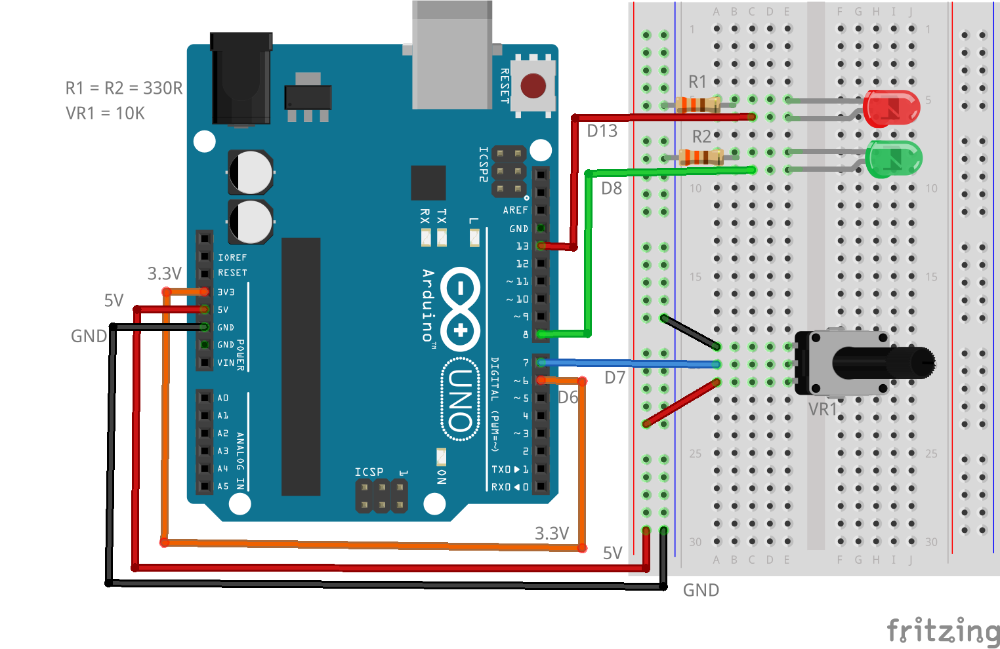

# LibAnaComp

An example library to use the Analog Comparator from Arduino C++ sketches. The library is written in Assembly but can be used from Arduino sketches, PlatformIO applications and/or Assembly Language sketches.

Oh, by the way, I'm Scottish and speak some English. I spell "analog" as "analogue", however, when referring to the Analog Comparator, I use its given name, "Analog" -- because it's polite to spell its name the way its parents did! For all other uses of the word, analog, I spell it as analogue -- because that is the correct spelling! (Fight me!)

## Installation

The library is supplied as a zip file, `libanacomp.zip` and should be installed into the Arduino IDE in the usual manner:

* In the IDE, click Sketch->Include Library->Add ZIP Library.
* Navigate to where you saved the `libanacomp.zip` file.
* Double-click it.

The library and Arduino examples will be installed. in the Arduino IDE, there are two supplied examples, one using polling in the `loop()` to determine if the ACO bit has been set, the second example uses interrupts and no polling.


## Description

The library is written in AVR Assembly Language as a "beginners" project for a new Arduino book I'm writing. I have written the library to expose all the features of the Analog Comparator apart from the Input Capture connection to Timer/counter 1.

The Analog Comparator will toggle the state of bit ACO in the ACSR register whenever the analogue voltage on pin AIN0 is greater than the voltage on pin AIN1. By default, these two pins are D6 and D7, however, any of the analogue pins on your Arduino board can be used as the AIN1 pin.

The AIN0 pin is the reference voltage. This can be set to either Arduino pin D6 or the internal bandgap reference voltage of 1.1v.

The AIN1 pin is the voltage which will be sampled and compared with the AIN0 voltage.

Whenever the voltage on AIN0 is *greater* than the voltage on AIN1, then ACSR.ACO will be set, otherwise it is cleared.

Sketches can be written to use the Analog Comparator interrupt, or to ignore it altogether and use polling to test the state of the ACSR.ACO bit. An interrupt can be configured to trigger when ACSR.ACO toggles, falls or rises. If an interrupt is required, the C++ source must contain a function as per the following:

```C++
ISR(ANALOG_COMP_vect) {
    // Do something here...
    // For example, set/clear the builtin LED
    // on D13/PB5.

    // First, for Arduino code:
    digitalWrite(8, !!(ACSR & (1 << ACO)));

    // Or for PlatformIO/AVR C++ code:
    // Commented out.
    /*
    if (ACSR & (1 << ACO)) {
       PORTB |= (1 << PORTB5);   // D13 High.
    } else {
       PORTB &= ~(1 << PORTB5);  // D13 Low.
    }
    */
}
```

If the sketch is written in Assembly Language, the something similar to the following example is required, if the Analog Comparator interrupt is being used:

```
// Do something here...
// For example, set/clear the builtin LED
// on D13/PB5

.global ANALOG_COMP_vect

ANALOG_COMP_vect:
    push r18                    // Save working register.
    in r18,ACSR                 // Current ACSR value.
    sbrs r18,ACO                // Skip next, if ACO = 1.
    cbi PORTB,PORTB0            // ACO = 0, turn D8 LED off.
    sbrc r18,ACO                // Skip next, if ACO = 0.
    sbi PORTB,PORTB0            // ACO = 1, turn D8 LED on.
    pop r18                     // Restore working register. 
    reti   
```

If the sketch uses an interrupt handler, then the interrupt flag bit, ACSR.ACI, is cleared automatically. Otherwise, the sketch code must write a 1 to this bit in order to clear it.


## Constants

The `acBegin()` function, see below, requires three parameters. The header file `libanacomp.h` provides a number of suitable constants.

### AIN0 Pin Selector for Reference Voltage

The valid values for the first parameter to `acBegin()` are defined in the following typedef:

```C++
typedef enum acReferencePin : uint8_t {
    acAIN0_D6 = 0,
    acAIN0_PD6 = acAIN0_D6,
    acAIN0_Internal = (1 << ACBG),
    acAIN0_1v1 = acAIN0_Internal
} acReferencePin_t;
```

The values correspond to:

* `acAIN0_D6` and `acAIN0_PD6` both have the value zero and configure Arduino pin D6, AVR pin PD6, to be the reference voltage pin, AIN0.
*  `acAIN0_Internal` and `acAIN0_1v1` configure the internal bandgap 1.1V to be the reference voltage for the AIN0 input.

### AIN1 Pin Selector for Sampled Voltage

The valid values for the second parameter to `acBegin()` are defined in the following typedef:

```C++
typedef enum acSampleVoltage : uint8_t {
    // Arduino pin numbers
    acAIN1_A0 = 0,
    acAIN1_A1 = 1,
    acAIN1_A2 = 2,
    acAIN1_A3 = 3,
    acAIN1_A4 = 4,
    acAIN1_A5 = 5,
    acAIN1_D7 = 8,
    // AVR pin names
    acAIN1_PC0 = acAIN1_A0,
    acAIN1_PC1 = acAIN1_A1,
    acAIN1_PC2 = acAIN1_A2,
    acAIN1_PC3 = acAIN1_A3,
    acAIN1_PC4 = acAIN1_A4,
    acAIN1_PC5 = acAIN1_A5,
    acAIN1_PD7 = acAIN1_D7,
    // AVR ADC pin names, note two extras
    // for the surface mount variant.
    acAIN1_ADC0 = acAIN1_A0,
    acAIN1_ADC1 = acAIN1_A1,
    acAIN1_ADC2 = acAIN1_A2,
    acAIN1_ADC3 = acAIN1_A3,
    acAIN1_ADC4 = acAIN1_A4,
    acAIN1_ADC5 = acAIN1_A5,
    acAIN1_ADC6 = 6,
    acAIN1_ADC7 = 7
} acSamplePin_t;
```

The values correspond to:

* `acAIN1_A0` through `acAIN1_A5` configure Arduino pins A0 through A5 as the sample voltage on the AIN1 comparator input.
* `acAIN1_PC0` through `acAIN1_PC5` configure AVR pins PC0 through PC5 as the sample voltage on the AIN1 comparator input. These are the same as Arduino pins A0 through A5, but named using the AVR pin names as opposed to the Arduino names.
* `acAIN1_ADC0` through `acAIN1_ADC7` configure one of the seven, yes seven, ADC input pins as the Comparator's AIN1 input pin. The first five of these correspond to the two options listed above, while `acAIN1_ADC6` and `acAIN1_ADC7` correspond to the two additional ADC input pins available on the 32 pin surface mount variants of the ATMNega328P. The Arduino Nano has these two additional pins.


### Interrupt Trigger Selector

```C++
typedef enum acTrigger : uint8_t {
    acTOGGLE  = 0,
    acFALLING = (1 << ACIS1),
    acRISING  = ((1 << ACIS1) | (1 << ACIS0)),
    acNONE    = (1 << 7)
} acTrigger_t;
```


 This parameter determines when, or if, the Analog Comparator interrupt will fire. The values permitted are:

* `acTOGGLE` which has the value 0.
* `acFALLING` which has the value 2.
* `acRISING` which has the value 3.
* `acNONE` with has the value 128.

The value 1 is reserved by Atmel/Microchip and as such, cannot be used. The header file `libanacomp.h` should be `#include`d to set up the correct definitions for the trigger stimulus.

In Assembly code, the following will suffice, assuming the avr-gas assembler is being used. Standalone assemblers may have a different syntax, please consult your manual.

```
.equ acTOGGLE,0
.equ acFALLING,(1 << ACIS1)
.equ acRISING,((1 << ACIS1)|(1 << ACIS0))
.equ acNONE,(1 << 7)
```

## Functions

The library exposes the following functions to setup and disable the Analog Comparator.

---
### acBegin()

```C++
void acBegin(acReferencePin_t ref     = acAIN0_PD6, 
             acSamplePin_t    samp    = acAIN1_PD7,
             acTrigger_t      trigger = acNONE);
```

The `acBegin()` function configures and enables the Analog Comparator and, if interrupts are enabled, those are now able to trigger and cause the execution of the `ISR(ANALOG_COMP_vect)` function.

The function can be called with no parameters and in which case, it will default to:

* AIN0 will be configured to use pin D6, AVR pin PD6.
* AIN1 will be configured to use pin D7, AVR pin PD7.
* The Analog Comparator interrupt will be disabled.

To call `acBegin()` in an Arduino sketch, or in AVR C++, use the following *after* calling `acSetup()` and optionally, `acInterrupt()`:

```C++
    acBegin();
```

---
### acDisable()

```C++
void acDisable()
```

This function, `acDisable()` disables the AC interrupt and shuts down the AC itself. The GPIO functionality for pins AIN0/D6 and AIN1/D7 is restored i they were disabled by `acBegin()`.

To call `acDisable()` in an Arduino sketch, or in AVR C++, use the following:

```C++
    acDisable();
```

If you call this function in a sketch then you should call `acSetup()` and, optionally if interrupts are required, `acInterrupt()` again as this function resets the Analog Comparator.

---

## Example Breadboard Layout

Set up a breadboard as follows:



The AIN0/D6/PD6 pin is connected to the Arduino's 3.3V rail. This is used as the reference voltage. A 10K potentiometer is connected to the 5V and GND rails with the wiper, the middle contact, connected to AIN1/D7/PD7 which is the sampled voltage.

Pin D13/PB5 is connected to an external red LED and a 330 Ohm resistor, while pin D8/PB0 is connected to a green LED and another 330 Ohm resistor.

When you adjust the potentiometer, the green LED will light up whenever the 3.3V on pin AIN0/D6/PD6 is *greater* than the voltage supplied by the potentiometer to pin AIN1/D7/PD7. 

In the interrupt enabled sketches, the red LED on pin D13/PB5 will be flashing periodically in the main `loop()` and is there, simply to show that interrupt handlers don't care about if, or when, your code calls the `delay()` function, as the interrupt handler will take priority. In other words, if the `loop()` is executing the `delay(2000)` command, and you turn the voltage on AIN1/D7/PD7 down to less that the 3.3V on pin AIN0/D6/PD6, then the green LED will toggle, regardless of the fact that a `delay()` is executing.

Obviously, in the non-interrupt sketches, the `delay()` calls *would* interfere, so the red LED is disabled in those sketches. Only the green LED is active. Additionally, in these sketches, the Analog Comparator is *not* disabled after the `loop()` has been executed a number of times.


All of the example sketches expect the above breadboard layout to be used.

## Arduino Examples

The Arduino examples can be found in the `Examples/Arduino` directory, or from the Arduino IDE, after the library has been installed, from File->Examples->libAnaComp.

### Example 1 - Interrupt Enabled.

The `Arduino/libAnaComp-example.ino` sketch is an example of using the Analog Comparator with the interrupt enabled. The interrupt trigger is configured to be whenever the ACO bit toggles. The green LED will reflect the state of the pin.

This sketch is approximately 1,156 bytes in size.

### Example 2 - Interrupt Disabled.

The `Arduino/libAnaComp-noInterrupt.ino` sketch is an example of using the Analog Comparator with the interrupt disabled. In this case, the delay between flashes of the red LED would interfere with the ability of the `loop()` to quickly respond to your turning the potentiometer and thus, toggling the green LED according to the Analog Comparator's output.

For this reason, the red LED on D13 is not actually used. Only the green LED will respond. 

This sketch is approximately 856 bytes in size.


## PlatformIO and AVR C++ Examples

### Example 1 - Interrupt Enabled.

The sketch `PlatformIO/libAnaComp-example.ino` is an AVR C++ version of the Arduino sketch with the same name. It operates in exactly the same manner, but is far smaller in size.

This sketch is approximately 332 bytes in size.

### Example 2 - Interrupt Disabled.

The sketch `PlatformIO/libAnaComp-noInterrupt.ino` is an AVR C++ version of the Arduino sketch with the same name. It operates in exactly the same manner, but is far smaller in size.

This sketch is approximately 266 bytes in size.

